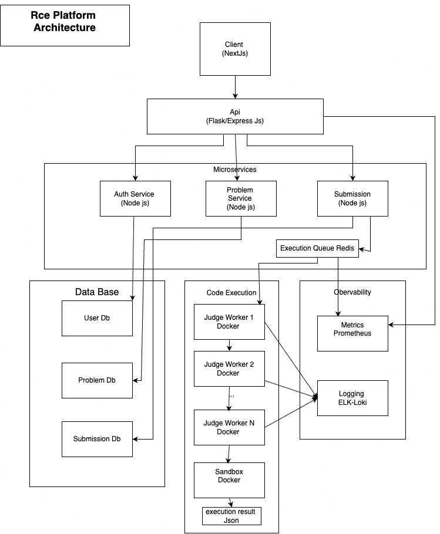

# Remote Code Execution System

This project is a scalable, production-ready Remote Code Execution (RCE) system built using Node.js, Redis, Docker, and MongoDB. It allows users to submit code (Python, C++, Java) which is executed inside Docker-based sandboxes. JWT authentication and MongoDB-backed persistence ensure secure and trackable execution.

---

## Features

- ✅ Supports Python, C++, and Java
- ✅ Secure sandboxed code execution using Docker containers
- ✅ Queue-based job handling with Redis
- ✅ Input/output redirection and expected output matching
- ✅ JWT-based user authentication
- ✅ MongoDB-backed submission logging
- ✅ Modular, microservice-compatible architecture

---

## Architecture




## System Components

### 1. `index.js`
Initializes the Express server, connects to MongoDB, sets up routes, and applies middleware.

### 2. `submission.controller.js`
Handles code submission logic, validates requests, and enqueues jobs in Redis.

### 3. `auth.route.js` & `auth.middleware.js`
Provides JWT-based registration/login and middleware for route protection.

### 4. `worker.js`
Listens to Redis queue, executes jobs in Docker containers, writes results to MongoDB.

### 5. `sandbox/`
Sandbox folder mounted into containers for isolated code execution.

### 6. `models/`
Defines Mongoose schemas for `User` and `Submission`.

---

## Supported Languages

- **Python**: via `python:3.11`
- **C++**: via `gcc:latest`
- **Java**: via `openjdk:latest`

---

## How It Works

1. User registers/login and receives a JWT.
2. Authenticated user sends a POST request to `/api/submit` with code, language, and expected output.
3. Controller validates input and enqueues a job to `codeQueue` on Redis.
4. Worker dequeues jobs, runs code inside Docker containers, captures output, and stores results in MongoDB.
5. Results can be retrieved via `/api/submissions` or `/api/submissions/:id`.

---

## API Endpoints

### Auth

- `POST /api/register`: Register a new user
- `POST /api/login`: Authenticate and receive JWT

### Submissions

- `POST /api/submit` – Submit code
  ```json
  {
    "code": ["print('Hello, World')"],
    "language": "py",
    "input": "",
    "expectedOutput": "Hello, World"
  }
GET /submissions – Get all submissions (JWT protected)

GET /submissions/:id – Get submission by ID (JWT required)